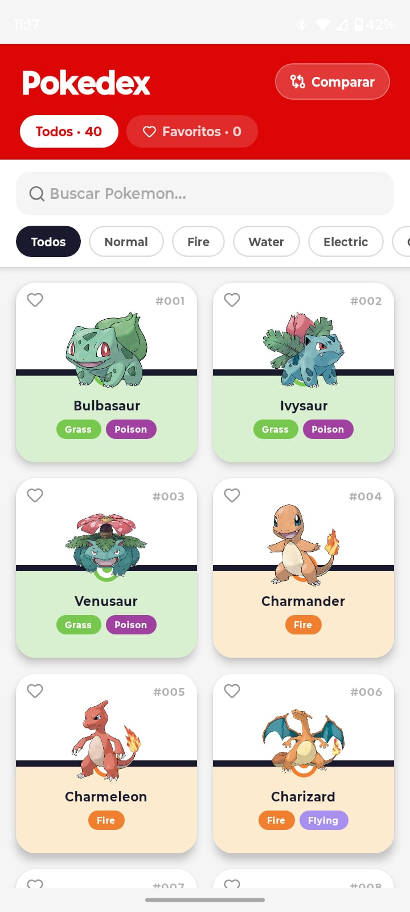
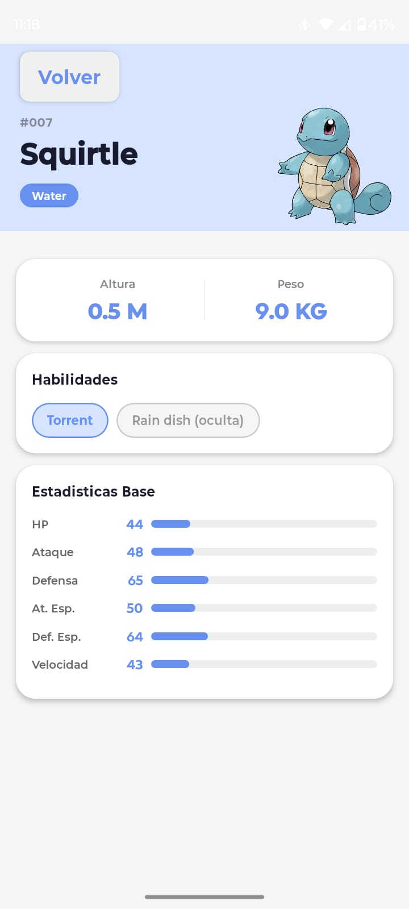
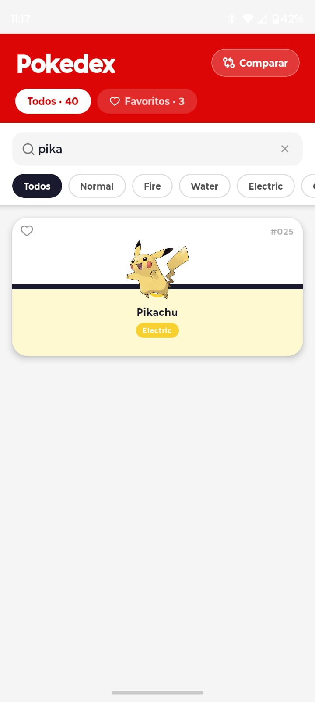
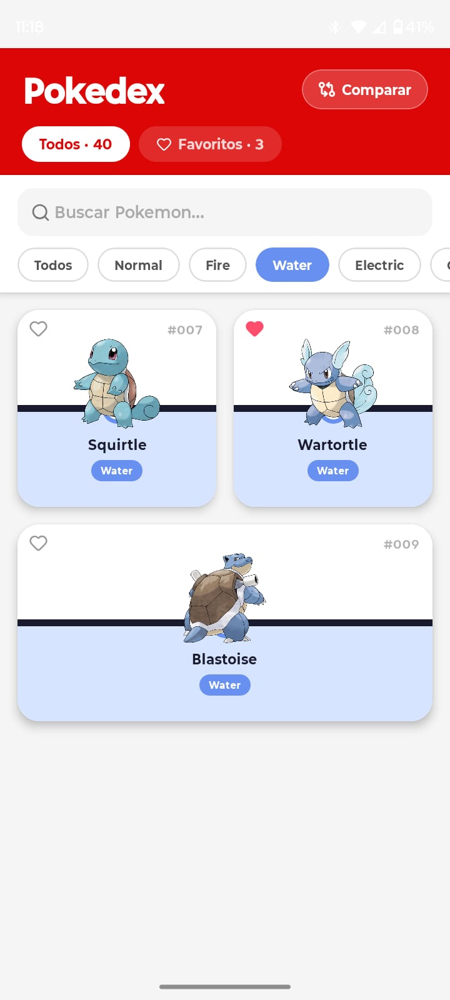
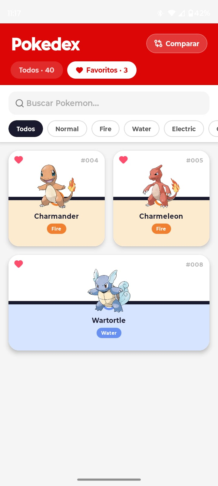
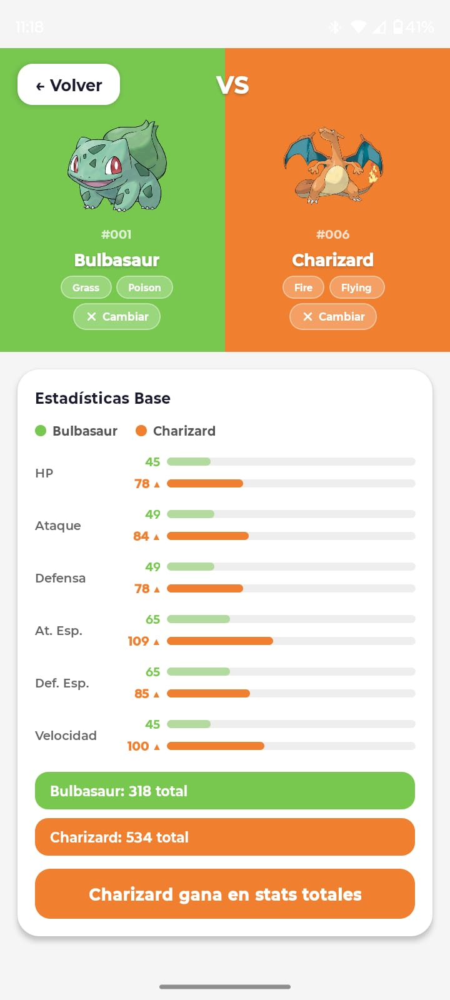

# Pokedex App
**Desarrollador:** Angel Rabago
---

## Descripcion

Aplicación movil desarrollada con React Native y Expo que consume la [PokéAPI](https://pokeapi.co/) para mostrar un listado de Pokemon con sus detalles, tipos, estadisticas base y habilidades. Permite navegar desde una pantalla principal con tarjetas visuales hasta una pantalla de detalle completa por cada Pokemon y comparar pokemones basados en sus estadisticas base.
---

## Tecnologías utilizadas

- [React Native](https://reactnative.dev/) con [Expo](https://expo.dev/) (~54)
- TypeScript
- React Navigation (Native Stack)
- PokéAPI REST (`https://pokeapi.co/api/v2`)
- react-native-safe-area-context
- react-native-screens
- pnpm (gestor de paquetes)

---

## Instalación

1. Clona el repositorio:
   ```bash
   git clone <url-del-repositorio>
   cd PokeApi---Expo
   ```

2. Instala las dependencias:
   ```bash
   pnpm install
   ```

3. Asegurate de tener Expo CLI disponible:
   ```bash
   npx expo install
   ```

---

## Ejecutar el proyecto

```bash
pnpm start
```

Luego escanea el QR con la app **Expo Go** en tu dispositivo, o presiona:
- `a` para abrir en emulador Android
- `i` para abrir en simulador iOS

---

## Funcionalidades implementadas

### Clase 1 — Listado de Pokémon
- Consumo de la PokeAPI para obtener los primeros 20 Pokemon
- Tarjetas visuales con imagen oficial, nombre, numero y tipos
- Diseño inspirado en la Pokebola con colores dinamicos por tipo
- Estado de carga con `ActivityIndicator`
- Estado de error con boton de reintento

### Clase 2 — Detalle del Pokémon
- Navegacion con React Navigation (stack nativo)
- Pantalla de detalle con:
  - Imagen oficial en grande
  - Tipos con colores dinámicos
  - Altura y peso
  - Habilidades normales y ocultas
  - Estadísticas base con barras de progreso animadas
- Header personalizado con botón de regreso
- Estados de carga y error en la pantalla de detalle

### Clase 3 — Busqueda, filtros y favoritos
- Busqueda por nombre
- Filtro por tipo
- Sistema de favoritos
- Persistencia de favoritos con AsyncStorage
- Mensaje de "sin resultados"

### Clase 4 — Comparador, cierre visual y demo final 
- Comparador de dos Pokemon
- Comparacion de estadisticas base lado a lado
- Pulido de diseño, espaciado, colores y responsividad
- Demo tecnica preparada (maximo 5 minutos)
- Entrega final subida al repositorio

---

## Capturas de pantalla

**Pantalla principal**


**Detalle del Pokémon**


**Búsqueda por nombre**


**Filtro por tipo**


**Favoritos**


**Comparador de Pokémon**
---

## Problemas encontrados y soluciones
**Multiples llamadas a la API al cargar la lista.**
Al obtener los primeros 20 Pokemon, la API solo devuelve nombres y URLs. Se tuvo que hacer una petición adicional por cada uno para obtener tipos e imagenes. Se resolvio con `Promise.all` para ejecutarlas en paralelo y no bloquear la carga.

**Cancelacion de efectos al desmontar componentes.**
Al navegar rapido entre pantallas, los `useEffect` intentaban actualizar el estado de un componente ya desmontado, generando warnings. Se implementó un flag `cancelada` dentro del efecto para ignorar la respuesta si el componente ya no esta montado.

**El comparador mostraba datos desincronizados al cambiar de Pokemon.**
Al seleccionar un nuevo Pokemon en el comparador, el estado anterior se mezclaba visualmente con el nuevo durante la carga. Se resolvió limpiando el estado del Pokemon anterior antes de iniciar la nueva peticion.
